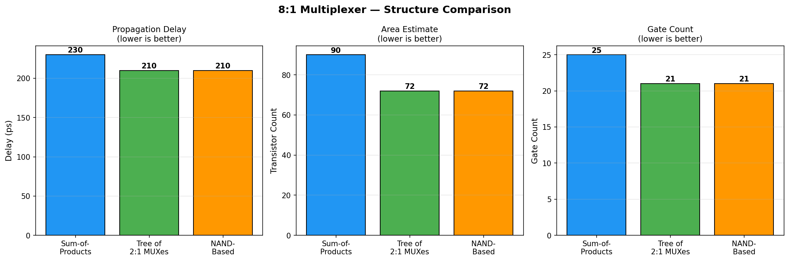
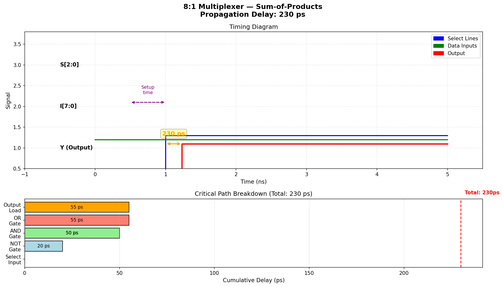

# Digital Multiplexer Structural Optimizer

An algorithmic C++ design automation tool that evaluates, simulates, and optimizes logic gate topologies for digital multiplexers ($4:1$, $8:1$, $16:1$). Given an optimization constraint (**Speed**, **Area**, or **Balanced**), the engine performs an exhaustive architectural search across multiple structural paradigms to synthesize the optimal silicon footprint and critical path delay.

---

## 🚀 Core Features

* **Multi-Topology Evaluation:** Analyzes and benchmarks three distinct structural implementations:
    1.  **Sum-of-Products (SoP):** A flat, low-depth AND-OR implementation direct from canonical boolean expressions.
    2.  **Tree of 2:1 MUXes:** A hierarchical, logarithmic-depth cascade of sub-multiplexers.
    3.  **NAND-Based Realization:** A DeMorgan-optimized NAND-NAND structure minimizing transistor area.
* **Hardware-Accurate Modeling:** Simulates gate-level propagation delays based on realistic silicon characterization:
    * $\text{NOT} = 20\text{ ps}$
    * $\text{NAND} = 30\text{ ps}$
    * $\text{AND} = 50\text{ ps}$
    * $\text{OR} = 55\text{ ps}$
* **Physical Verification:** Embedded hardware-in-the-loop validation using an ATmega328P (Arduino Uno) executing $1,000$ randomized test vectors to correlate simulated logic depth with real-world sequential execution times.

---

## 📊 Optimization Results ($8:1$ MUX Analysis)

Our EDA engine generated the following structural benchmarks for an $8:1$ Multiplexer configuration:

### 1. Structural Benchmarking
A direct comparison reveals that architectural choice depends heavily on the target design constraints. While the **Sum-of-Products** topology provides the lowest propagation delay, the **Tree of 2:1 MUXes** drastically minimizes silicon surface area and total gate count.

### 2. Critical Path & Waveform Simulation
The diagram below maps out the critical path timing constraints for the **Sum-of-Products** configuration during a select-line transition ($000 \rightarrow 101$). The simulated cumulative propagation delay settles precisely at $230\text{ ps}$.

